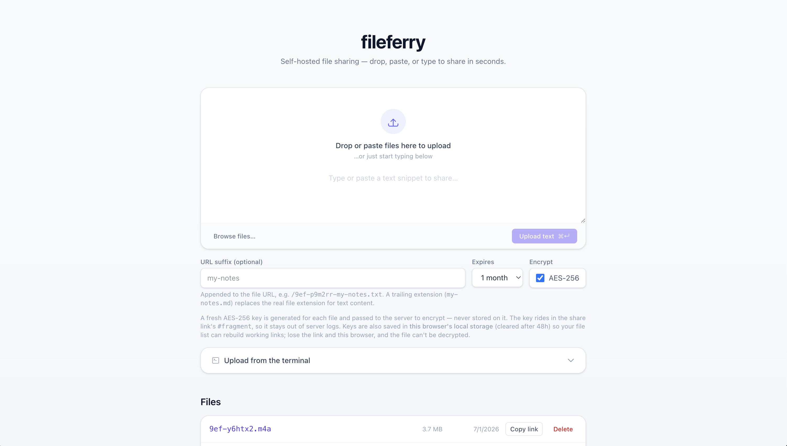

# fileferry

A single-binary, self-hosted file sharing service. No database, no external
services — just a binary and a data directory.

> **Status:** work in progress, not yet ready for widespread use.



## Features

- **Instant share links** — the URL streams back before the transfer finishes,
  and downloaders can tail-follow uploads still in progress.
- **Drop, paste, or type** — drag files in, paste text or a screenshot, or type
  a snippet. The `ferryupload` CLI covers scripts and the clipboard.
- **URL shortener** — a paste containing only a URL is served as a redirect.
- **Optional encryption** — AES-256-GCM with a random key kept only in the
  link's `#fragment`; the server never sees it.
- **Rich previews** — highlighted text, rendered Markdown, image/audio/video
  players, and archive listings. Add `?raw=1` for bytes or `?dl=1` to download.
- **Expiring uploads** — 1 day / week / month / year / never, per upload.

## Run the server

```sh
docker run -p 8080:8080 -v fileferry-data:/data \
  -e FILEFERRY_API_KEY=your-api-key \
  ghcr.io/garethgeorge/fileferry:latest
```

The web UI is then at `http://localhost:8080/upload/`. Without a
`FILEFERRY_API_KEY` the server prints a random ephemeral key on startup that the
web UI uses; set your own for scripted/CLI access.

### Docker Compose

```yaml
services:
  fileferry:
    image: ghcr.io/garethgeorge/fileferry:latest
    ports:
      - "8080:8080"
    volumes:
      - fileferry-data:/data
    environment:
      FILEFERRY_API_KEY: your-api-key
      FILEFERRY_BASE_URL: https://files.example.com
    restart: unless-stopped

volumes:
  fileferry-data:
```

### As a bare binary

```sh
curl -fsSL https://raw.githubusercontent.com/garethgeorge/fileferry/main/install.sh | sh -s -- ferryserver
ferryserver   # add flags, or set FILEFERRY_ env vars (see Configuration)
```

## Configuration

`ferryserver` takes every option as a flag or a `FILEFERRY_`-prefixed env var
(the flag wins if both are set):

| Flag                    | Env var                         | Default              | Meaning                                |
| ----------------------- | ------------------------------- | -------------------- | -------------------------------------- |
| `--addr`                | `FILEFERRY_ADDR`                | `:8080`              | listen address                         |
| `--data-dir`            | `FILEFERRY_DATA_DIR`            | `./data`             | where files are stored                 |
| `--base-url`            | `FILEFERRY_BASE_URL`            | derived from request | base URL used in returned share links  |
| `--max-size`            | `FILEFERRY_MAX_SIZE`            | 10 GiB               | maximum upload size in bytes           |
| `--default-expire-days` | `FILEFERRY_DEFAULT_EXPIRE_DAYS` | 365                  | default expiration in days (0 = never) |
| `--api-key`             | `FILEFERRY_API_KEY`             | _(none)_             | comma-separated Bearer keys for `/api` (an ephemeral key for the web UI is always added) |

Set `FILEFERRY_BASE_URL` to the address users reach the service at (or forward
`X-Forwarded-Proto`/`X-Forwarded-Host` through a proxy) so share links are
correct. The web UI at `/upload/` has no auth of its own — put an
authenticating reverse proxy in front of it if it shouldn't be public.
Download URLs (`/<fileid>`) are public but unguessable.

## The upload CLI

Install `ferryupload` (Linux/macOS; on Windows grab `ferryupload.exe` from the
[Releases page](https://github.com/garethgeorge/fileferry/releases)):

```sh
curl -fsSL https://raw.githubusercontent.com/garethgeorge/fileferry/main/install.sh | sh
```

Point it at your server and share things:

```sh
export FILEFERRY_SERVER=https://files.example.com
export FILEFERRY_API_KEY=your-api-key

ferryupload notes.txt            # a file
ferryupload ./project            # a folder (compressed to .tar.gz / .zip)
echo "hello" | ferryupload       # stdin
ferryupload --encrypt secret.pdf # AES-256; key rides in the #fragment
ferryupload --clipboard          # whatever's on the clipboard (see below)
```

It prints only the share URL to stdout (progress and errors go to stderr), so it
composes cleanly in scripts. `ferryupload --help` covers the rest (expiry, slug,
filename override, link shortening).

### Recommended: a clipboard hotkey

`--clipboard` uploads whatever you've copied — text, a screenshot, or a copied
file/folder — and **replaces the clipboard with the resulting link**. Bind it to
a hotkey and sharing becomes: copy → press keys → paste the link. GUI apps don't
inherit your shell, so set the two env vars inside the command.

**macOS** — Automator → new **Quick Action** → *Workflow receives no input* →
**Run Shell Script**:

```sh
export FILEFERRY_SERVER=https://files.example.com FILEFERRY_API_KEY=your-api-key
/usr/local/bin/ferryupload --clipboard
```

Save it, then assign a shortcut under System Settings → Keyboard → Keyboard
Shortcuts → Services.

**Windows** — set `FILEFERRY_SERVER` and `FILEFERRY_API_KEY` in *Environment
Variables*, then with [AutoHotkey](https://www.autohotkey.com) v2 (Win+U):

```ahk
#u::RunWait('"C:\Tools\ferryupload.exe" --clipboard', , "Hide")
```

**Linux** — save a wrapper as `~/.local/bin/ferry-clip` and bind a custom
keyboard shortcut to it (e.g. GNOME: Settings → Keyboard → Custom Shortcuts):

```sh
#!/bin/sh
export FILEFERRY_SERVER=https://files.example.com FILEFERRY_API_KEY=your-api-key
exec ferryupload --clipboard
```

## Development

```sh
just test         # go test -race ./...
just build
just css          # regenerate web/static/tailwind.css (needs the standalone tailwindcss CLI)
```

The web UI is static vanilla HTML/JS (`web/static/`), embedded with `go:embed`.
The generated Tailwind stylesheet is committed, so plain `go build` produces a
self-contained binary.
